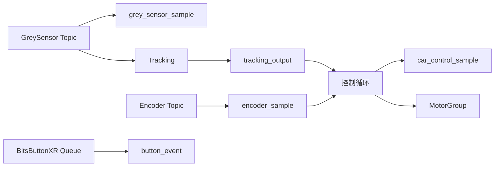

# 变更提案：结构化控制调试快照

## 元信息

```yaml
类型: 重构/优化
方案类型: implementation
优先级: P2
状态: 已确认
创建: 2026-07-13
```

---

## 1. 需求

### 背景

`src/car_control_support.cpp` 当前定义了大量 `volatile g_*` 调试变量。灰度、循迹、编码器和按键模块本身已经提供完整数据结构，逐字段镜像造成重复写入、状态不一致风险，并使 Ozone 变量列表难以阅读。

### 目标

- 在 `src/app_main.cpp` 暴露 `grey_sensor_sample`、`tracking_output`、`encoder_sample`、`button_event` 四个完整全局对象。
- 新增 `CarControlSupport::CarControlSample`，聚合没有现成 Sample 类型的控制周期、模式、Topic 新鲜度、距离和四轮控制中间量。
- 删除 `car_control_support.cpp/.hpp` 中所有纯调试用 `volatile g_*` 定义和声明。
- 保留 PID 参数、前馈参数和 PID 实例，它们是控制配置与运行状态，不属于重复调试镜像。
- 保持按键行为、Topic 新鲜度保护、循迹、定距和四轮速度闭环行为不变。

### 约束条件

```yaml
性能约束: 不增加控制周期中的动态分配；GreySensor 通过现有 Topic 非阻塞订阅
兼容性约束: 保持 MSPM0G3507、LibXR Application/Topic 和现有 C++20 构建方式
调试约束: 全局对象必须可在 Ozone 中按结构展开；对象不声明 volatile，以允许正常结构赋值
范围约束: 不修改 PID 参数、电机方向、循迹参数和按键功能
```

### 验收标准

- [ ] Ozone 可展开查看五个结构化全局对象。
- [ ] `car_control_support.cpp/.hpp` 不再包含纯调试 `volatile g_*` 镜像。
- [ ] `tracking_output` 与 `encoder_sample` 仍由各自 Topic 更新并参与控制。
- [ ] `grey_sensor_sample` 由新增的 GreySensor Topic 订阅器更新。
- [ ] Topic 陈旧时仍停止相关控制目标，并在 `car_control_sample` 中体现新鲜度和丢线状态。
- [ ] 结构验证、Topic 逻辑测试、固件构建和 Flash 预算检查通过。

---

## 2. 方案

### 技术方案

在 `CarControlSupport` 命名空间新增 `CarControlSample`。它保存 `control_time_ms`、`elapsed_ms`、`dt_s`、`drive_mode`、Topic 新鲜度、灰度有效电平配置、失线状态、前进距离，以及五组四轮控制数组。`app_main.cpp` 文件作用域定义四个现有完整对象和一个 `car_control_sample`。

主循环继续以 Topic 缓存作为控制输入：新增 GreySensor 订阅器只负责更新调试样本；Tracking 和 Encoder 订阅器保持原有控制职责。原来逐字段写入 `g_*` 的位置改为更新 `car_control_sample` 或直接使用完整对象字段。

### 变量归属

| 原变量 | 新归属 |
|--------|--------|
| `g_line_raw_mask` | `tracking_output.raw_mask` 与 `grey_sensor_sample.raw_mask` |
| `g_line_black_mask` | `tracking_output.black_mask` |
| `g_line_active_count` | `tracking_output.active_count` |
| `g_line_error` | `tracking_output.error` |
| `g_line_lost` | `car_control_sample.line_lost` |
| `g_line_following_enabled` | `car_control_sample.drive_mode == DriveMode::kLineFollowing` |
| `g_grey_sensor_active_low` | `car_control_sample.grey_sensor_active_low` |
| `g_tracking_topic_ready` | `car_control_sample.tracking_topic_ready` |
| `g_tracking_sequence` | `tracking_output.sequence` |
| `g_tracking_source_sequence` | `tracking_output.source_sequence` |
| `g_tracking_left_speed/right_speed` | `tracking_output.left_speed_rad_s/right_speed_rad_s` |
| `g_drive_mode` | `car_control_sample.drive_mode` |
| `g_last_button_event` | `button_event.event_type` |
| `g_last_button_index` | `button_event.key_alias`（控制内部临时解析索引） |
| `g_forward_distance_m` | `car_control_sample.forward_distance_m` |
| `g_encoder_count/angle/speed` | `encoder_sample.count/angle_rad/speed_rad_s` |
| `g_elapsed_ms/g_dt_s` | `car_control_sample.elapsed_ms/dt_s` |
| 五组四轮控制数组 | `car_control_sample` 对应 `std::array<float, 4>` 字段 |
| `jie` | 删除；当前没有读写方 |

### 影响范围

```yaml
涉及模块:
  - app_main: 全局快照、GreySensor 订阅与控制状态更新
  - car_control_support: 新控制快照类型和旧镜像清理
  - tests: 结构断言更新
  - knowledge: XRobotModules 调试数据流说明与变更日志
预计变更文件: 6-8
```

### 风险评估

| 风险 | 等级 | 应对 |
|------|------|------|
| GreySensor 多订阅者读取语义变化 | 中 | 使用独立 `ASyncSubscriber<GreySensor::Sample>`，不直接调用 `Read()` |
| 把聚合对象声明为 volatile 导致结构赋值失败 | 中 | 五个全局对象均保持普通对象；运行时写入本身保证调试数据更新 |
| 删除方向修正后的编码器镜像改变观测含义 | 低 | 原始值在 `encoder_sample`，控制侧修正速度在 `car_control_sample.measured_speed` |
| 旧测试绑定 `g_line_lost` | 低 | 先更新结构测试为新字段，再实施源码迁移 |

---

## 3. 技术设计

### 数据流



### `CarControlSample` 字段

| 字段 | 类型 | 说明 |
|------|------|------|
| `control_time_ms` | `uint32_t` | 最近一次控制周期的系统时间 |
| `elapsed_ms` / `dt_s` | `uint32_t` / `float` | 控制周期长度 |
| `drive_mode` | `DriveMode` | 当前驾驶模式 |
| `encoder_topic_ready` | `bool` | 编码器 Topic 是否新鲜 |
| `tracking_topic_ready` | `bool` | 循迹 Topic 是否新鲜 |
| `grey_sensor_active_low` | `bool` | 灰度输入有效电平配置 |
| `line_lost` | `bool` | 综合 Topic 陈旧与 Tracking 输出的丢线状态 |
| `forward_distance_m` | `float` | 当前定距累计值 |
| 五组四轮数组 | `std::array<float, kMotorCount>` | 目标、反馈、前馈、PID 修正和最终电机输出 |

---

## 4. 核心场景

### 场景：Ozone 查看完整控制链路

**模块**：app_main / CarControlSupport  
**条件**：固件正在运行且 Ozone 已加载调试符号。  
**行为**：展开五个全局对象。  
**结果**：可以从原始灰度输入一路查看循迹输出、编码器反馈、最近按键和四轮控制输出，无需查找大量独立变量。

---

## 5. 技术决策

### 结构化控制调试快照#D001：优先复用模块完整样本并聚合剩余控制状态

**日期**：2026-07-13  
**状态**：✅采纳  
**背景**：用户要求减少散落全局变量并保持 Ozone 可观测性。  
**决策**：复用四个现有完整数据结构，为没有统一类型的控制环中间量新增一个 `CarControlSample`。  
**理由**：最大限度减少重复状态，同时不修改模块公共接口或控制算法。  
**影响**：`app_main.cpp` 成为调试快照的所有者；`car_control_support` 只保留类型、算法和可调控制参数。

---

## 6. 成果设计

N/A：本任务没有视觉界面产出。
