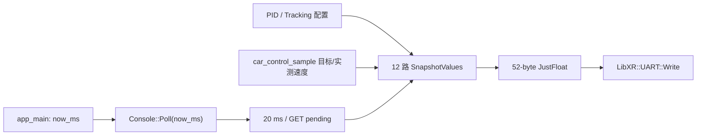

# 变更提案: pid-tuning-speed-telemetry

## 元信息
```yaml
类型: 新功能
方案类型: implementation
优先级: P1
状态: 已确认
创建: 2026-07-17
```

---

## 1. 需求

### 背景
当前 PID 调参 JustFloat 快照只上传 8 项静态配置，无法在 VOFA+ 中连续比较
左右轮目标速度和四路编码器反馈。现有 Console 也只在 `pid,get` 时发送快照，
不适合观察速度环动态响应。

### 目标
- 将上行快照调整为 12 路：6 项调参值、2 项左右目标速度和 4 项实际轮速。
- 从上行移除 `i_limit/out_limit`，但保留对应下行 SET 调参能力。
- 使用 20 ms 周期连续发送，即 50 Hz。
- 保持 UART 非阻塞写入和忙时重试。

### 约束条件
```yaml
时间约束: 自动发送周期固定为 20 ms
性能约束: 52 字节帧不得阻塞 5 ms 控制循环；UART 繁忙时延后重试
兼容性约束: 保留 pid,get、全部 pid,set 参数名、范围校验和热更新行为
业务约束: 目标与实测速度使用 rad/s，实测值采用控制层已经方向修正的结果
```

### 验收标准
- [ ] JustFloat 帧为 12 个 float 加四字节帧尾，总长 52 字节。
- [ ] 通道顺序与设计表一致，不再上传 `i_limit/out_limit`。
- [ ] `i_limit/out_limit` 仍可通过 `pid,set` 修改。
- [ ] 20 ms 到期自动发送，`pid,get` 仍能立即请求一帧。
- [ ] UART 空间不足、BUSY 或 FULL 时不阻塞并可恢复重试。
- [ ] 主机单元测试、集成检查和 ARM 固件构建通过。

---

## 2. 方案

### 技术方案
1. 将 `kSnapshotValueCount` 从 8 改为 12，JustFloat 帧长随之变为 52 字节。
2. 固定上行通道顺序为：
   `velocity_gain, static_output, p, i, turn_kp, turn_kd,
   left_target, right_target, front_left_measured,
   front_right_measured, back_left_measured, back_right_measured`。
3. `Console::Poll()` 接收主循环已有的 `now_ms`，使用回绕安全的无符号时间差
   产生 20 ms 周期快照。
4. `TryEmitSnapshot()` 从 `car_control_sample` 读取最新目标与实测速度；写入成功
   后才更新时间，写端口繁忙时保留 pending。
5. 先更新测试并验证 RED，再实施最小代码使其转为 GREEN。

### 影响范围
```yaml
涉及模块:
  - PidTuning Protocol: 调整通道数、帧长和字段顺序
  - PidTuning Console: 增加 50 Hz 调度与控制快照采集
  - app_main: 将现有 now_ms 传入 Console::Poll
  - Tests: 覆盖新帧、速度映射、周期边界与失败重试
  - Knowledge Base: 同步 PidTuning 通道协议与验证说明
预计变更文件: 7-9
```

### 风险评估
| 风险 | 等级 | 应对 |
|------|------|------|
| VOFA+ 仍按旧 8 通道解释 | 中 | 固定记录新通道表并更新知识库 |
| 50 Hz 抢占 UART 队列 | 中 | 发送前检查空间，失败保留 pending，不阻塞等待 |
| 时间计数回绕导致调度异常 | 低 | 使用无符号差值比较 |
| 目标与反馈符号不一致 | 低 | 直接采用控制层已方向修正的 measured_speed |

---

## 3. 技术设计（可选）

> 涉及架构变更、API设计、数据模型变更时填写

### 架构设计


### API设计
#### `Console::Poll(uint32_t now_ms)`
- **请求**: 主循环当前毫秒时间。
- **响应**: 非阻塞处理 RX，并在 GET、周期到期或待发重试时尝试发送快照。

#### `EncodeJustFloatFrame(const SnapshotValues&, JustFloatFrame&)`
- **请求**: 固定顺序的 12 个 `float`。
- **响应**: 52 字节 JustFloat 帧。

### 数据模型
| 字段 | 类型 | 说明 |
|------|------|------|
| `SnapshotValues[0..5]` | float32 LE | 前馈、速度 PI 和循迹 PD 参数 |
| `SnapshotValues[6..7]` | float32 LE | 左右轮目标速度，rad/s |
| `SnapshotValues[8..11]` | float32 LE | 左前、右前、左后、右后实际速度，rad/s |
| 帧尾 | 4 bytes | `00 00 80 7F` |

---

## 4. 核心场景

> 执行完成后同步到对应模块文档

### 场景: VOFA+ 连续观察速度环
**模块**: PidTuning

**条件**: Console 已启用，主循环持续调用 `Poll(now_ms)`

**行为**: 每 20 ms 采集配置、左右目标和四轮实测速度并发送 JustFloat

**结果**: VOFA+ 以 50 Hz 连续显示 12 路数据

### 场景: UART 暂时繁忙
**模块**: PidTuning / MSPM0UART

**条件**: WritePort 空间不足或 `uart_.Write()` 返回 BUSY/FULL

**行为**: 保留 pending，不更新时间戳，下一次 Poll 重试

**结果**: 主控制循环不阻塞，UART 恢复后发送最新快照

---

## 5. 技术决策

> 本方案涉及的技术决策，归档后成为决策的唯一完整记录

### pid-tuning-speed-telemetry#D001: 使用主循环时间驱动 Console 周期发送
**日期**: 2026-07-17
**状态**: ✅采纳
**背景**: 轮速曲线需要稳定 50 Hz 时间基准，同时主机测试需要可控时间。
**选项分析**:
| 选项 | 优点 | 缺点 |
|------|------|------|
| A: `Poll(now_ms)` | 复用主循环时间、测试确定、无新增时钟依赖 | 修改一处调用接口 |
| B: Console 内取全局时间 | 调用点不变 | 增加依赖且测试需要模拟时钟 |
| C: app_main 外部请求快照 | Console 更被动 | 调度状态分散到主控制逻辑 |
**决策**: 选择方案 A
**理由**: 改动小、时间语义清晰，并能直接验证 20 ms 边界与回绕行为。
**影响**: `Console::Poll`、`app_main.cpp` 调用点和 Console 主机测试。

---

## 6. 成果设计

N/A（嵌入式二进制遥测协议，无视觉交付物）。
