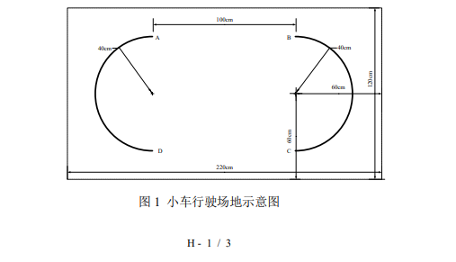

# 2024 年全国大学生电子设计竞赛赛区赛

## 暨模拟电子系统设计专题赛初赛

# 自动行驶小车（H 题）

**【本科组/高职高专组】**

## 一、任务

设计一个采用 TI MSPM0 系列 MCU 控制的自动行驶小车，能在指定路径上自动行驶，行驶场地示意如图 1 所示。场地面积不小于 220 cm × 120 cm。图中两个对称半圆弧线的半径为 40 cm，弧线为黑色，线宽 1.8 cm 左右，弧线的四个顶点分别定义为 A、B、C 和 D 点。建议场地采用白色哑光喷绘布制作。场地除两个半圆弧外，不得添加任何标记。

图 1 小车行驶场地示意图

## 二、要求

（1）将小车放在位置 A 点，小车能自动行驶到 B 点停车，停车时有声光提示。用时不大于 15 秒。（20 分）

（2）将小车放在位置 A 点，小车能自动行驶到 B 点后，沿半弧线行驶到 C 点，再由 C 点自动行驶到 D 点，最后沿半弧线行驶到 A 点停车，每经过一个点，声光提示一次。完成一圈用时不大于 30 秒。（20 分）

（3）将小车放在位置 A 点，小车能自动行驶到 C 点后，沿半弧线行驶到 B 点，再由 B 点自动行驶到 D 点，最后沿半弧线行驶到 A 点停车。每经过一个点，声光提示一次。完成一圈用时不大于 40 秒。（30 分）

（4）按要求 3 的路径自动行驶 4 圈停车，用时越少越好。（30 分）

（5）设计报告。（20 分）

## 三、说明

（1）作品中的小车尺寸不大于 25 cm（长）× 15 cm（宽）× 15 cm（高）。小车尺寸包括小车以及小车所安装的传感器等总体的轮廓尺寸大小。小车采用轮式小车，不得采用履带和麦氏轮。小车行驶时只能前进，不得后退。必须采用 TI MSPM0 系列 MCU 控制小车的状态，不得采用其他型号的 MCU。小车控制板安装时需暴露其 TI MSPM0 芯片，便于测试时查验。小车上不得安装摄像头。不符合规定的小车不进行测试。

（2）行驶场地水平铺设于平整的地面，除题目要求的圆弧之外，行驶场地上不得有其他任何指示标记（包括 ABCD 四个字符）。不得对测试场地外环境有任何要求。为了适应测试场地，允许测试前小车试跑。

（3）小车不得借助周围环境物品导航。场地内外不得架设任何其他装置设备。正式测试时，小车行驶过程中不得人为干涉、遥控小车运动。测试时，应允许相关人员在场地外围走动。

（4）本题目所有小车在起始点的摆放方向自定。要求的小车停车动作及行驶经过 A、B、C、D 点时，必须有声光提示。启动、停车及行驶经过 A、B、C、D 点时，小车的地面投影必须覆盖圆弧顶点；小车所有在圆弧上的行驶过程，其投影必须在弧线上，投影脱离圆弧即认为此次测试失败，此项目不得分。

（5）所有测试项目如果完成时间超过规定时间一倍以上时，此项目不得分。

（6）小车采用车载电池供电。进入测试环节，中途不得更换电池。

## 四、评分标准

| 类别 | 项目 | 主要内容 | 满分 |
|---|---|---|---:|
| 设计报告 | 系统方案 | 小车自动行驶的设计方案 | 3 |
| 设计报告 | 理论分析 | 小车自动行驶误差分析；小车轨迹控制 | 5 |
| 设计报告 | 电路与程序设计 | 控制电路及程序流程 | 5 |
| 设计报告 | 测试方案与测试结果 | 测试数据完成性；测试结果分析 | 4 |
| 设计报告 | 设计报告结构及规范性 | 摘要；设计报告正文的结构；图标的规范性 | 3 |
| 设计报告 | **合计** |  | **20** |
| 要求 | 完成第（1）项 |  | 20 |
| 要求 | 完成第（2）项 |  | 20 |
| 要求 | 完成第（3）项 |  | 30 |
| 要求 | 完成第（4）项 |  | 30 |
| 要求 | **合计** |  | **100** |
|  | **总分** |  | **120** |
