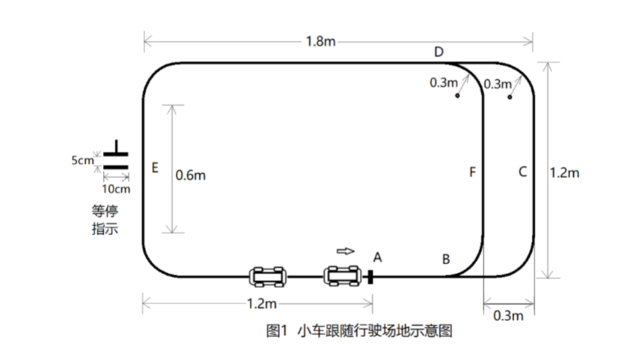

# 2022 年广西大学生电子设计竞赛

## 小车跟随行驶系统（H 题）

**高职高专组**

## 一、任务

设计一套小车跟随行驶系统，由一辆领头小车和一辆跟随小车组成，要求小车具有循迹功能，且速度在 0.3～1 m/s 可调，能在指定路径上完成行驶操作，行驶场地的路径如图 1 所示。

其中，路径上的 A 点为领头小车每次行驶的起始点和终点。当小车完成一次行驶到达终点，领头小车和跟随小车要发出声音提示。

领头小车和跟随小车既可以沿着 ABFDE 圆角矩形（简称为**内圈**）路径行驶，也可以沿着 ABCDE 圆角矩形（简称为**外圈**）路径行驶。当行驶在内圈 BFD 段时，小车要发出灯光指示。

此外，在测试过程中，可以在路径上 E 点所在边的直线区域，由测试专家指定位置放上“等停指示”标识（见图 1 左侧），指示领头小车在此处须停车，等待 5 秒后再继续行驶。

*图 1 小车跟随行驶场地示意图*

## 二、要求

### 1. 外圈单圈跟随测试（20 分）

将领头小车放在路径的起始位置 A 点，跟随小车放在其后 20 cm 处，设定领头小车速度为 0.3 m/s，沿着外圈路径行驶一圈停止。要求：

1. 领头小车的平均速度误差不大于 10%；
2. 跟随小车能跟随领头小车行驶，全程不能发生小车碰撞；
3. 完成一圈行驶后，领头小车到达 A 点处停车，跟随小车应及时停止，停止时间差不超过 1 s，且与领头小车的间距为 20 cm，误差不大于 6 cm。

### 2. 快速追赶与外圈双圈测试（20 分）

将领头小车放在路径轨迹的起始位置 A 点，跟随小车放在路径上 E 点所在边的直线区域，由测试专家指定的位置，设定领头小车速度为 0.5 m/s，沿着外圈路径行驶两圈停止。要求：

1. 领头小车的平均速度误差不大于 10%；
2. 跟随小车能快速追上领头小车，然后按 20 cm 间距跟随领头小车行驶，全程不能发生小车碰撞；
3. 完成两圈行驶后，领头小车到达 A 点停止，跟随小车应及时停止，两车停止的时间差不超过 1 s，且与领头小车的间距为 20 cm，误差不大于 6 cm。

### 3. “等停指示”识别与停车测试（30 分）

由测试专家在路径的 E 点所在边的直线区域指定位置，放上“等停指示”标识。然后，将领头小车放在路径的起始位置 A 点，跟随小车放在其后 20 cm 处，设定领头小车速度为 1 m/s，沿着外圈路径行驶一圈停止，行驶中两小车不得发生碰撞。要求：

1. 领头小车的平均速度误差不大于 10%；
2. 领头小车到达“等停指示”点停车，停车位置准确，误差不大于 5 cm；跟随小车应及时停止，两车停止的时间差不超过 1 s，且与领头小车的间距为 20 cm，误差不大于 6 cm；
3. 领头小车在“等停指示”处停车 5 s（误差不超过 1 s）后，继续行驶至 A 点停车；跟随小车跟随行驶至停车点停车，且与领头小车的间距为 20 cm，误差不大于 6 cm。

### 4. 双车超车与反超测试（20 分）

将领头小车放在路径的起始位置 A 点，跟随小车放在其后 20 cm 处，领头小车和跟随小车连续完成两圈路径的行驶。

第一圈领头小车沿着外圈路径行驶，跟随小车沿着内圈路径行驶，实现超车领跑。第二圈跟随小车沿着外圈路径行驶，领头小车沿着内圈路径行驶，实现反超和再次领跑。要求：

1. 全程两个小车行驶平稳，顺利完成两次超车，且不能发生小车碰撞；
2. 完成两圈行驶后，领头小车到达 A 点停止，跟随小车应及时停止，两车停止的时间差不超过 1 s，且与领头小车的间距为 20 cm，误差不大于 6 cm；
3. 小车行驶速度可自主设定，但不得低于 0.3 m/s，且完成所规定的两圈轨迹行驶所需时间越短越好。

### 5. 其他（10 分）

### 6. 设计报告（20 分）

| 项目     | 分类                 | 主要内容                                         |   满分 |
| -------- | -------------------- | ------------------------------------------------ | -----: |
| 设计报告 | 系统方案             | 小车跟随行驶的设计方案                           |      3 |
| 设计报告 | 理论分析             | 小车间通信模式分析；小车运控设计；小车间距离控制 |      5 |
| 设计报告 | 电路与程序设计       | 小车循迹电路；小车间通信电路；小车防撞设计电路   |      5 |
| 设计报告 | 测试方案与测试结果   | 测试方法与仪器；测试数据完成性；测试结果分析     |      4 |
| 设计报告 | 设计报告结构及规范性 | 摘要；设计报告正文的结构；图标的规范性           |      3 |
|          | **总分**             |                                                  | **20** |

## 三、说明

1. 作品中的小车尺寸不大于 15 cm（宽）× 25 cm（长）。小车尺寸包括小车本体以及小车所安装的传感器等总体尺寸。

2. 行驶场地上铺设白纸，行驶路径用 1 cm 宽的黑色引导线来标志，可以印刷或打印在白纸上，也可以用黑色胶带纸直接粘贴在白纸上。轨迹上的起始点 A 用垂直贴在路径引导线的黑色标志线来标记，标志线为 2 cm 宽、5 cm 长。“等停指示”用间隔 5 cm 的两条 2 cm 宽、10 cm 长的黑色平行标志线来标记，可以事先在一张小纸片上打印好，测试时对接粘贴在行驶路径的引导线上即可。除题目要求的标记之外，行驶场地上不得有其他任何指示标记。

3. 跟随小车的行驶完全由领头小车指挥控制。领头小车上有启动按键和设置按键，而跟随小车只有一个上电开关，不得有其他启动和操作按键。每一次行驶发车时，领头小车和跟随小车按照题目要求摆放在行驶路径的指定位置，跟随小车上电，处于等待接收领头小车指令的状态。领头小车一键启动行驶，直到整个行驶过程结束。

4. 在两个小车跟随行驶过程中，除了两个小车间的相互通信外，不得有车外遥控和其他通信指令辅助。

5. 在本题目要求 4 中，领头小车遇到“等停指示”需立即停车，停车后车身应在“等停指示”第二条横线以内，车头超出第二条横线的距离为停车位置误差。

6. 为了便于测试，允许在制作行驶场地时，在路径的 E 点和 A 点的旁边画上刻度尺，如图 2 所示。

*图 2 行驶场地可以画出刻度*
